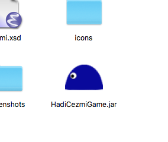
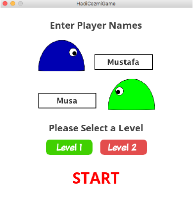
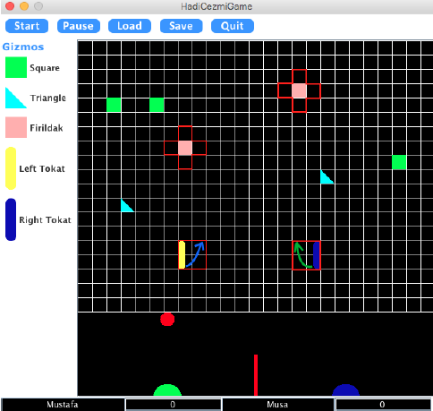
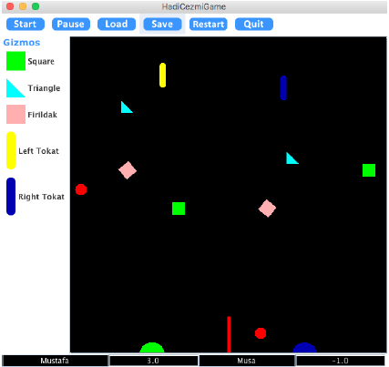
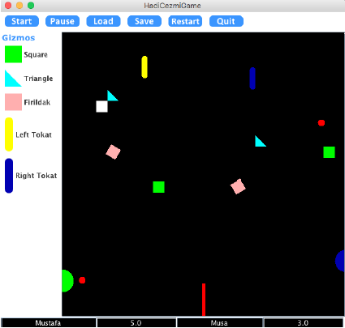
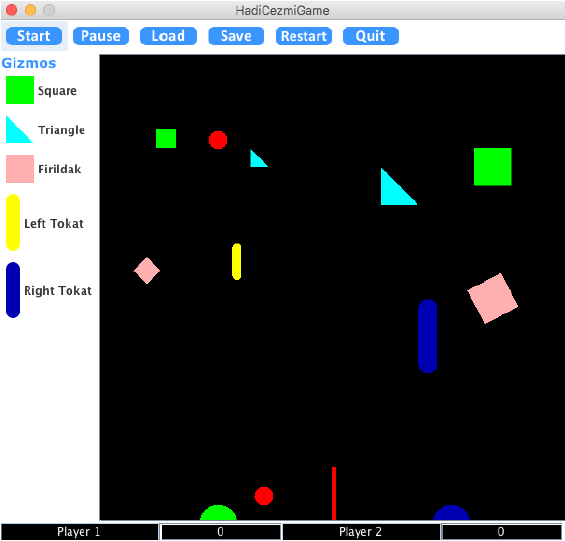

# HadiCezmi (2D Multiplayer Game) &nbsp;:video_game:

:computer: &nbsp;**Fall 2016 COMP 302 Software Engineering Term Project, Koç University**

**Project Name:**&nbsp;&nbsp;HadiCezmi 
**Group Name:**&nbsp;&nbsp;JusticeLeague 
**Group Members:**&nbsp;&nbsp;Evrim Turan, Musa Çıbık, Mustafa Acıkaraoğlu, Mustafa Saraç 

#### For more detailed questions, you can contact me at this email address: msarac13@ku.edu.tr &nbsp;&nbsp;:email:
 
## DESCRIPTION
HadiCezmi is a 2D arcade game which enables two players to play in competing manner. Players design game board by adding gizmos, rotating and/or deleting them in edit mode, and they play the game in running mode. Players can save and load the game configuration to and from an XML file. 

:information_source: Please check the following game guide for more detailed questions.

## Game Guide

### Table of Contents
1. **Setup**
2. **Edit Mode** 
2.1. Setup the Game  
2.2. Placing a Gizmo  
2.3. Rotating a Gizmo  
2.4. Removing a Gizmo  
2.5. Moving a Gizmo  
2.6. Switch to Run Mode  
3. **Running Mode**  
3.1. Moving the Cezmis  
3.2. Slapping with the Tokats  
3.3. Pause, Start and Restart  
3.4. Rules  
&nbsp;&nbsp;&nbsp;&nbsp;&nbsp;&nbsp; 3.4.1. Cezerye  
&nbsp;&nbsp;&nbsp;&nbsp;&nbsp;&nbsp; 3.4.2. Score 
4. **Save and Load**  
4.1. Save the Game  
4.2. Load a Game

### 1. Setup
Double click the jar file to run the program. Make sure the latest version of Java is installed. The game runs on Java so that it is multi-platform.   
<kbd>
  
</kbd>

**Minimum system requirements:**
- 1 GB RAM
- Windows 7 or later, Linux, MAC OS X
- Latest version of JRE

### 2. Edit Mode 

**2.1. Setup the Game**  
Type the player’s names to the appropriate space. Select the level, then click the “start” button.    
<kbd>
  
</kbd>

**2.2. Placing A Gizmo**  
Left-click the Gizmo type you want to place to the board. Mouse the mouse to the location you want to place the Gizmo. Left-click on the Gizmo to finish the process. Editing part of the board is marked with horizontal and vertical lines. Placing a Gizmo to the middle column is prohibited. Tokats occupy a square 2L by 2L. Firildak occupies a plus shaped 5 square2 polygon.    
<kbd>
  
</kbd>

**2.3. Rotating A Gizmo**  
Middle-click on the Gizmo you want to apply 90 degree clockwise rotation.

**2.4. Removing A Gizmo**  
Right-click on the Gizmo you want to remove.

**2.5. Moving A Gizmo**  
Place the mouse on the Gizmo you want to move. Drag and drop the Gizmo to the its new location.

**2.6. Switch to Run Mode**  
Click the “Start” button to switch to run mode. If every player has 4 Gizmos on their editing area, the game will switch to run mode. If this is not the case, the user will be asked to do so.

### 3. Running Mode 

<kbd>
  
</kbd>
  

**3.1. Moving the Cezmis**  
If not specified in the XML file, Player1 should press “a” and “d” keys to move his/her Cezmi to left and the right respectively. The keys for the Player2 are left arrow and right arrow. If the game is running on Level2, Cezmis can move on the wall as well. When they reach to the wall pressing the keys will move them vertically on the wall.    

<kbd>
  
</kbd>
   
 
**3.2. Slapping with the Tokats**  
To apply a “slap” to the LeftTokat Player1 should press the “space” button. Player2 should press “enter” to slap the RightTokat. The second press for the keys will move the tokats to their initial positions.

**3.3. Pause, Start and Restart**  
To pause the game anytime, please click the “pause” button. The run a paused game, click the “start” button. 
To restart the game (for example to change the current level), click restart. You will be switch to the opening screen.

**3.4. Rules**

&nbsp;&nbsp;&nbsp;**3.4.1 Cezerye**  
Cezerye is a white square-shaped object which will appear on the screen randomly. The duration between two consecutive appear of Cezerye differs from 5 to 30 seconds. The appear time for the Cezerye is 5 seconds. If a player hit the Cezerye with the ball, one of the 3 special events will occur for 2 seconds.   
This special events are:
- The player’s Gizmos will double their sizes.
- The opponent player’s Gizmo will halve their sizes.
- The opponent player’s Cezmi will be stunted.
 
<kbd>
  
</kbd>
    

&nbsp;&nbsp;&nbsp;**3.4.2 Score**  

If the game is not loaded from a file, each player starts with zero points.
- When the ball lands on a player’s court, (bottom wall on his/her side) the other player gets 1 point.
- If the ball lands just after bouncing a Tokat, the player gets 2 points instead of 1 point.
- The game ends when a player collects 10 points.
- A player loses 1 point if their gizmo hits the ball which ends up hitting the same player’s ground without the interaction with the wall of the other player.
- If the player’s gizmo hits the ball and the ball hits the separating wall “Engel”, he loses 0.5 points.
- If Cezmi hits the ball and it immediately hits the roof, he loses 0.5 points.

### 4. Save and Load

**4.1. Save the Game**  
In order to save the game, you are playing or editing, click the save button. After selecting the directory and type the name for your file, click the save button of the popped up screen.

**4.2. Load the Game**  
In order to load the game while you are playing or when you are in edit mode, click the load button. After selecting the file, you want to load, click the load button of the popped up screen.
